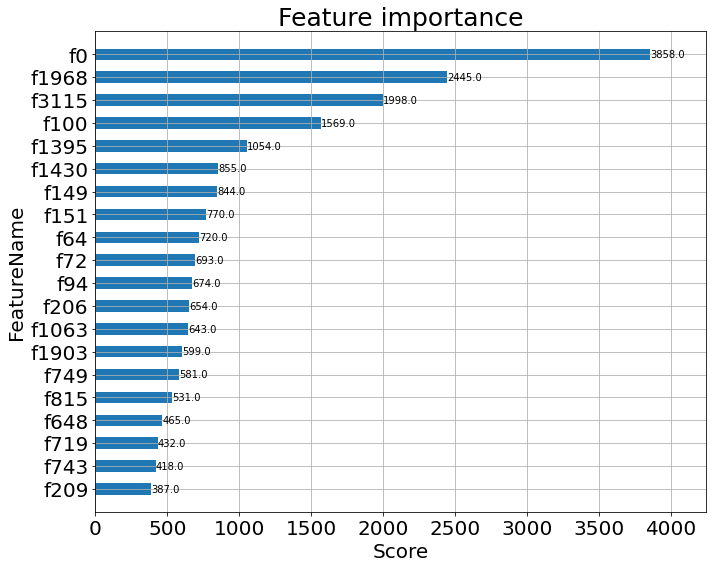

# Text-Classification
machine learning for text classification
>In this notebook, we will introduce a text classification project, the main task is a topic prediction for a text(**question or statement** etc.).

### Description
1. The labels include 16 classes, which is described in data/label.csv
 eg. <small>生活｜心理学｜电影｜游戏｜恋爱｜音乐｜大学｜心理｜情感｜互联网｜社会｜人际交往｜教育｜汽车	｜医学｜法律</small>
2. The datasets include train(129176) / test(32614), you can see in the dir(data)
3. We will use a small dataset to set the example. eg.10000
4. We will use some traditional statistical features like TFIDF..
5. Model type : **XgBoost/RandomForest**
6. pipeline of this project
feature extractor | model training | params selection  | data balance etc..

### NOTE
for about feature selection / params selection :
1. use the inline function, like CV(cross validation) to choose the best params; 
2. use xgb.plot_importance to figure out the most important feature.
3. use grid search to find a beet params

### RUN
You can directly run each step in the notebook sequentially so that you understand what each step does.
